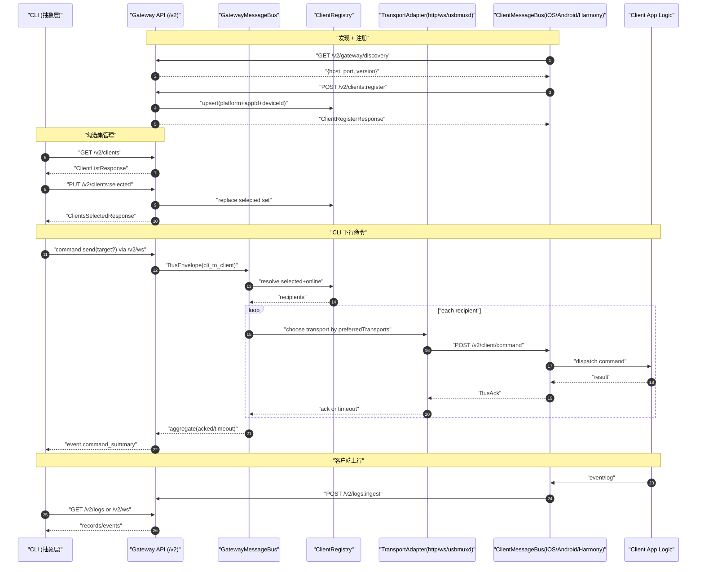
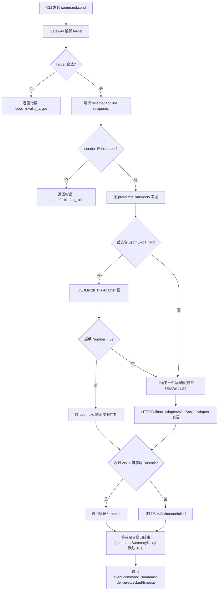
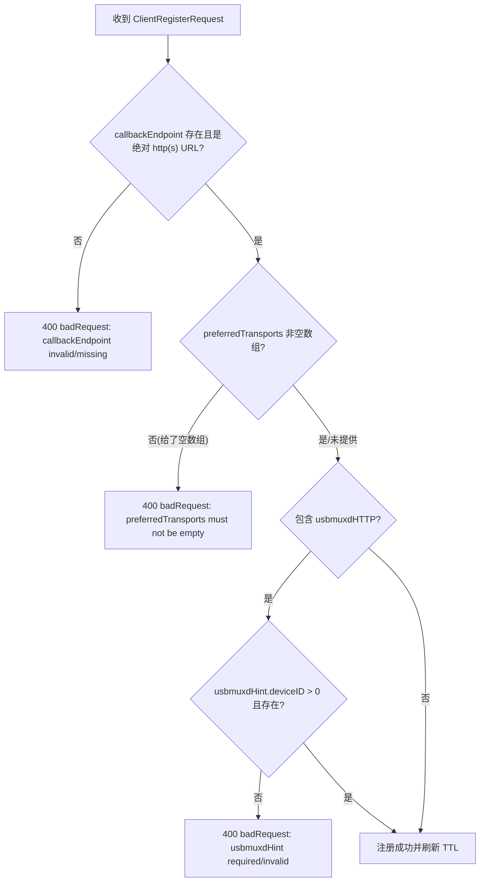
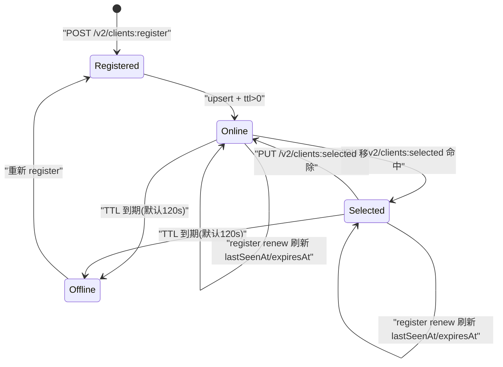

# Neptune `/v2` 架构图总览（泳道 + 失败分支 + 状态机 + 字段表）

> 状态：已落地实现对齐稿（2026-03-25）  
> 策略：`/v2 only`，不维护历史别名字段作为主协议。

## 0. 约束与默认值
- `direction` 仅允许：`cli_to_client`、`client_to_cli`。
- 单目标命令回调超时：`3s`（`commandCallbackTimeout`）。
- 命令聚合摘要延迟：沿用网关默认 `10s`（`commandSummaryDelay`）。
- 客户端在线 TTL：默认 `120s`，注册续约刷新 TTL。
- `usbmuxd` 仅用于 macOS 侧 Gateway/CLI 下行链路。

## 1. 主链路泳道图

## 2. 失败分支图（重点）

### 注册校验失败分支（`POST /v2/clients:register`）

## 3. 客户端状态机图

## 4. `/v2` 字段字典

### 4.1 BusEnvelope（命令/事件总线）
| 字段 | 必填 | 方向 | 默认值 | 校验规则 | 失败行为 |
|---|---|---|---|---|---|
| `direction` | 是 | 双向 | 无 | 仅 `cli_to_client` / `client_to_cli` | 客户端返回 `status=error, message=unsupported direction` |
| `kind` | 是（客户端模型） | 双向 | 无 | `command/event/log` | 非 `command` 入站命令返回 `unsupported message kind` |
| `requestId` | 否 | 双向 | 网关/客户端可补生成 | 非空字符串（如存在） | 无 requestId 仍可处理，ACK 带空或补值 |
| `command` | `kind=command` 时应有 | `cli_to_client` | 无 | 当前仅支持 `ping` | 返回 `status=error, message=unsupported command` |
| `logRecord` | `kind=log` 时应有 | `client_to_cli` | 无 | 结构应可序列化为 ingest 记录 | 不合法由上报方丢弃或返回错误 |
| `event` | `kind=event` 时应有 | `client_to_cli` | 无 | `name` 非空 | 不合法事件不进入总线 |
| `timestamp` | 否 | 双向 | 发送端当前时间 | ISO8601 字符串建议 | 缺失不阻塞处理 |

### 4.2 BusAck（命令回执）
| 字段 | 必填 | 方向 | 默认值 | 校验规则 | 失败行为 |
|---|---|---|---|---|---|
| `requestId` | 否 | `client_to_cli` | 透传入站 requestId | 字符串 | 无 requestId 仍聚合 |
| `command` | 否 | `client_to_cli` | 从 envelope 归一化 | 当前命令集仅 `ping` | 作为诊断字段 |
| `status` | 是 | `client_to_cli` | 无 | `ok` / `error` | `error` 记为已回执但失败 |
| `message` | 否 | `client_to_cli` | 无 | 可读错误说明 | 展示到 `event.command_ack` |
| `timestamp` | 是 | `client_to_cli` | 发送端当前时间 | ISO8601 字符串 | 缺失时由接收端可补 |

### 4.3 `POST /v2/clients:register`
| 字段 | 必填 | 默认值 | 校验规则 | 错误码/失败行为 |
|---|---|---|---|---|
| `platform` | 是 | 无 | 非空；`ios/android/harmony/web` | `400 badRequest` |
| `appId` | 是 | 无 | 非空字符串 | `400 badRequest` |
| `deviceId` | 是 | 无 | 非空字符串 | `400 badRequest` |
| `sessionId` | 否 | `"unknown"` | 可空；空白会归一化 | 无 |
| `callbackEndpoint` | 是 | 无 | 绝对 `http(s)` URL | `400 badRequest` |
| `preferredTransports` | 否 | `[httpCallback]` | 若提供则不可空，去重保序 | `400 badRequest` |
| `usbmuxdHint.deviceID` | 条件必填 | 无 | 当 transports 含 `usbmuxdHTTP` 时必须存在且 `>0` | `400 badRequest` |
| `expiresAt` | 否 | `now + 120s` | 若超界会 clamp 到 `[now, now+ttl]` | 非法格式回退默认 TTL |

### 4.4 `PUT /v2/clients:selected`
| 字段 | 必填 | 默认值 | 校验规则 | 错误码/失败行为 |
|---|---|---|---|---|
| `items[]` | 是（实现路径） | 无 | 每项需 `platform+appId+deviceId` | `400 badRequest` |
| `selected[]` | 否（兼容别名） | 无 | 若提供则等价映射到 `items` | 解码时自动兼容 |

### 4.5 命令入口与聚合输出
| 通道 | 输入 | 输出 | 关键语义 |
|---|---|---|---|
| `POST /v2/client/command`（客户端本地） | `BusEnvelope(kind=command,direction=cli_to_client)` | `BusAck` | 仅 `ping` 保证支持 |
| `/v2/ws` `command.send`（CLI -> Gateway） | 可带 `target` 过滤 | `command.accepted` + `event.command_ack` + `event.command_summary` | summary 中 `timeout = delivered - acked` |

## 5. 契约字段与当前实现映射（联调必读）
| 目标语义（contracts） | 当前网关/SDK主实现字段 | 说明 |
|---|---|---|
| `id` | `requestId` | 当前统一使用 `requestId` 作为相关性键 |
| `type + topic` | `kind + command` | `command/event/log` 用 `kind`，命令名用 `command` |
| `BusAck.accepted` | `BusAck.status` (`ok/error`) | 语义等价：`ok` 可视为 accepted |
| `target.platform/appId/deviceId/sessionId` | `target.platforms/appIds/deviceIds/sessionIds` | 当前目标过滤使用数组字段 |

> 联调建议：先按“当前实现字段”跑通，再收敛到 contracts 的最终线型字段命名。

## 6. 验收清单（可执行联调）
- 按第 1 节可完成：`command.send(ping)` -> 客户端 ACK -> `event.command_summary` 闭环。
- 按第 2 节可定位：`timeout/failed` 是 transport、校验，还是客户端不支持命令。
- 按第 4 节可覆盖契约测试：编码解码、必填字段、条件必填（`usbmuxdHint`）与错误路径。
